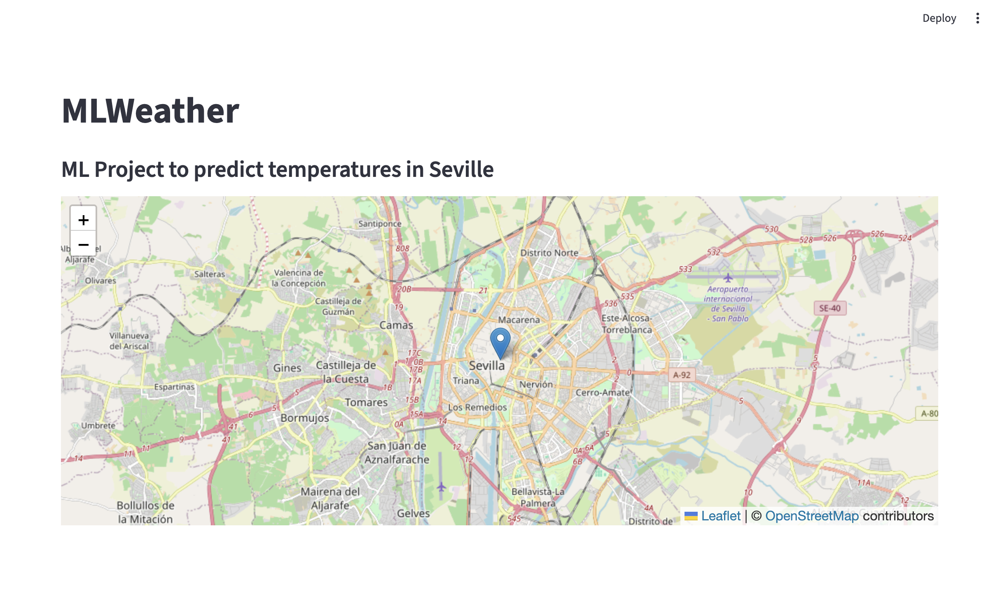
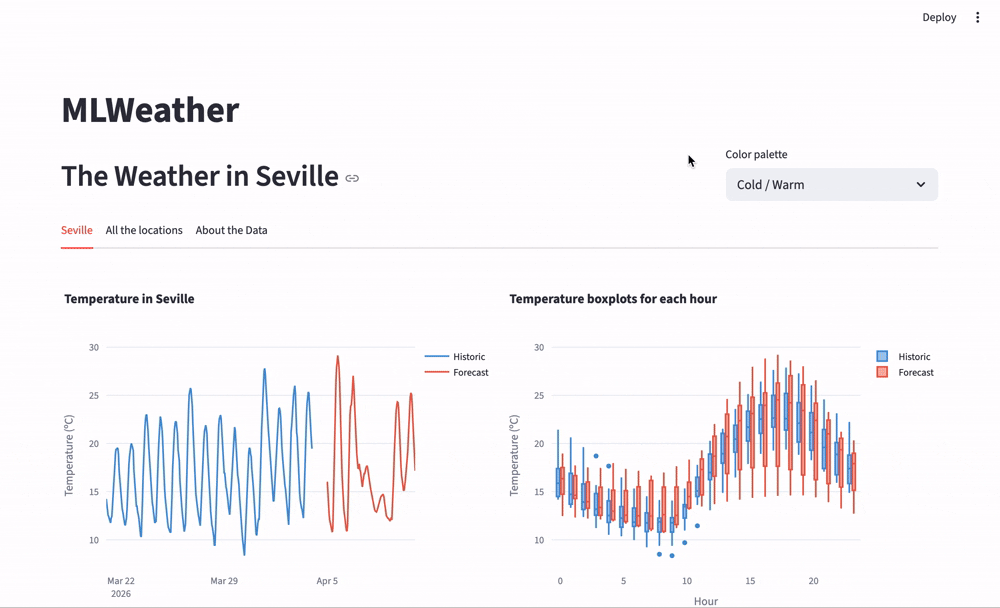

# MLWeather

A machine learning project to forecast hourly temperature in Seville, Spain.
It compares five models (Linear Regression, XGBoost, Random Forest, SARIMA and LSTM) trained on historical weather data and evaluated with MAE, RMSE and R².
Results are presented in an interactive Streamlit app.

##  Project Structure

```
MLWeather/
│
├── README.md
├── requirements.txt                # Python libraries and versions
├── .gitignore
├── .python-version
|
├── makefile                        # To run the project
|
├── app.py                          # Streamlit app
|
├── data/
│   ├── description/                # Description of features of data
│   ├── predictions/                # Prediction data of the models
│   ├── forecast_data.csv           # Forecast data
│   ├── historic_data.csv           # Historic data
|   ├── treated_forecast_data.csv   # Processed forecast data
|   └── treated_historic_data.csv   # Processed historic data
|
├── notebooks/                      # Study of data and models...
│   ├── forecast_analysis.ipynb     # Analysis of forecast data
|   ├── historic_analysis.ipynb     # Analysis of historic data
|   ├── lstm_analysis.ipynb         # Notebook with LSTM model
|   ├── random_forest.ipynb         # Notebook with Random Forest model
|   ├── sarima_analysis.ipynb       # Notebook with SARIMA model
│   └── xgboost_analysis.ipynb      # Notebook with XGBoost model
|
├── src/
|   ├── data_treatment.py           # Reading, treatment, preprocessing... 
|   ├── forecast_data.py            # Forecast data collection
|   └── historic_data.py            # Historic data collection
|
├── models/
|   ├── {model}_info                # Model information saved
│   ├── linear_model.py             # Linear Regression + lags
│   ├── lstm_model.py               # LSTM
│   ├── random_forest.py            # Random Forest
│   ├── sarima_model.py             # SARIMA
│   └── xgboost_model.py            # XGBoost
│
├── notes/                          # Some theory notes
│   ├── linear_model.md             # Notes on Linear Regression
│   ├── lstm_model.md               # Notes on LSTM
│   ├── random_forest.md            # Notes on Random Forest
│   ├── sarima_model.md             # Notes on SARIMA
│   └── xgboost_model.md            # Notes on XGBoost
│
├── evaluation/
│   ├── metrics.json                # json file with model metrics
│   └── metrics.py                  # Computes model metrics
│
├── ui/
|   └── charts.py                   # Graphics for streamlit
|
└── preview/                        # Folder for preview files of the app
```

## Preview

### Home page



### Visualization tab



### Predictions tab


## Setup

Install dependencies:
```bash
make install
```

## Usage

The project is managed via `make`. The available commands are:

| Command | Description |
|---|---|
| `make install` | Install Python dependencies from `requirements.txt` |
| `make data` | Fetch and process historical and forecast data |
| `make models` | Train all models (Linear, XGBoost, Random Forest, SARIMA, LSTM) |
| `make app` | Launch the Streamlit app |
| `make all` | Run the full pipeline: data → models → app |

To run the full pipeline from scratch:
```bash
make all
```

Or step by step:
```bash
make data
make models
make app
```

## Getting the Data

The Data is sourced from [Open-Meteo](https://open-meteo.com/). Under the [_Available APIs_](https://open-meteo.com/en/features#available_apis) section:

* [Historical Weather API](https://open-meteo.com/en/docs/historical-weather-api): Used to train the models. Data is collected from multiple locations around Seville.
* [Forecast API](https://open-meteo.com/en/docs): Used to generate predictions for Seville based on nearby locations.

## Models

Five forecasting models are implemented:

| Model | Description |
|---|---|
| Linear Regression | Baseline model with lag features |
| XGBoost | Gradient boosting with lag features |
| Random Forest | Ensemble of decision trees |
| SARIMA | Classical statistical model for time series |
| LSTM | Recurrent neural network for sequential data |

Evaluation metrics (MAE, RMSE, R²) are stored in `evaluation/metrics.json` after training.


